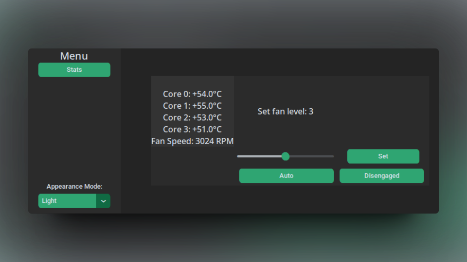

# THINKFAN-GUI

This program provides a user-friendly interface for managing fan speeds on Thinkpads using Thinkfan. Built with CustomTkinter, the application offers a sleek and intuitive design, allowing users to easily control and monitor their fan speeds.

<div style="text-align:center">
    
</div>

## 🔒Prerequisites
- **Thinkfan** must be installed
- Python 3.x

## 🔧Setup

Clone this repository to your local machine:

```bash
git clone https://github.com/darchap/thinkfan-gui
cd thinkfan-gui
```

Install the required Python packages:

```bash
python3 -m pip install -r requirements.txt
```

Run the application:

```bash
python3 main.py
```
